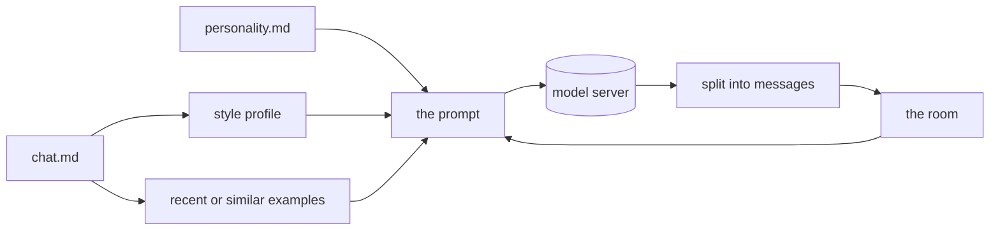

<div align="center">


### A chatbot that writes like a person you know

_A short description, a transcript, and a model on your own computer._


[](LICENSE)


<p align="center">
  <a href="#overview"><b>Overview</b></a> |
  <a href="#start"><b>Start</b></a> |
  <a href="#make-an-identity"><b>Identities</b></a> |
  <a href="#rooms"><b>Rooms</b></a> |
  <a href="#import-a-chat"><b>Import</b></a> |
  <a href="#score-an-identity"><b>Score</b></a> |
  <a href="#how-a-reply-is-made"><b>How it works</b></a> |
  <a href="docs/roadmap.md"><b>Roadmap</b></a>
</p>

<a href="https://ko-fi.com/stivengjekaj"></a>

</div>

---

> [!NOTE]
> **The code of each phase is built, and P4 waits for a real run.**
> The window shows replies while the model writes, the members can talk for a
> number of turns, and `mimikr import` reads WhatsApp, Telegram and Discord.
> `mimikr eval` scores the chat mode and the continuation mode, with recent or
> similar examples. The tests prove each part with a fake model.
> No real model has run the score yet, so the defaults are not proven.
> [docs/roadmap.md](docs/roadmap.md) says what comes next, and
> [docs/milestones.md](docs/milestones.md) holds each decision and the reason
> for it.

---

## Overview

**mimikr** writes chat messages in the style of a person.
You give it two files for each person: a short description and a transcript of
the messages of that person.
mimikr measures how the person writes, and tells a language model on your
computer to write in the same way.

You talk to the identities in rooms.
A room holds you and one or more identities, and the identities can also talk
to each other.

<table>
<tr>
<td width="50%" valign="top">

### What it does

- **Reads a transcript** in plain `Name: message` lines.
- **Measures the style**: length, capitals, periods, emoji, stock replies,
  and messages in a row.
- **Writes like the person**, with a real sample of their messages in the
  prompt.
- **Sends short messages in a row** when the person does.
- **Holds rooms** with one or more identities.

</td>
<td width="50%" valign="top">

### How it behaves

- It runs on your computer. The data goes to your model server only.
- It works with Ollama, LM Studio, llama.cpp, and each other server with the
  OpenAI chat API.
- It reads the files of an identity again for each reply, so an edit takes
  effect at once.
- It never changes the files of an identity.
- A native window, on macOS, Windows and Linux.

</td>
</tr>
</table>

---

## Start

You need Python 3.11 or later, [uv](https://docs.astral.sh/uv/), and a local
model server.
With [Ollama](https://ollama.com):

```bash
ollama pull llama3.1
```

Or with [llama.cpp](https://github.com/ggml-org/llama.cpp), which serves one
model on each server. Start one server for the chat model, and one for the
embedding model:

```bash
llama-server -m ~/Models/Mistral-Nemo-Instruct-2407-Q4_K_M.gguf --port 8080 --alias mistral-nemo
llama-server -m ~/Models/nomic-embed-text-v1.5.Q8_0.gguf --embeddings --port 8081 --alias nomic-embed-text
```

Then tell mimikr where they are, in `mimikr.toml`:

```toml
base_url = "http://localhost:8080/v1"
embedding_url = "http://localhost:8081/v1"
model = "mistral-nemo"
```

Then start mimikr from the root of the repository:

```bash
uv sync
uv run mimikr
```

To try the two invented examples:

```bash
MIMIKR_IDENTITIES_DIR=examples/identities uv run mimikr
```

---

## Make an identity

Make one directory for each identity in `identities/`:

```
identities/
  alex/
    personality.md    necessary: a short description of the person
    chat.md           optional: a transcript of their messages
    identity.toml     optional: the settings of this identity
```

`chat.md` holds one message on each line:

```
[2025-03-02 23:41] June: are you still awake
Alex: unfortunately
Alex: just got home
  and the kitchen was chaos
```

- The time in brackets is optional.
- A line that starts with a space continues the previous message.
- A line that starts with `#` is a comment.

`identity.toml` changes the defaults:

```toml
display_name = "Alex"
speaker = "alex_99"     # the name of the person in chat.md
model = "qwen2.5"       # a different model for this identity
temperature = 0.7
mode = "continue"       # "chat" or "continue", as the setting below
```

If `speaker` is not set, mimikr uses the display name.
If `display_name` is not set, mimikr uses the name of the directory.

This command shows what mimikr found in each identity:

```bash
uv run mimikr check
```

```
june (June)
  chat.md: none
sam (Sam)
  chat.md: 11 messages from 'Sam'
  - A usual message has about 3 words.
  - Start most messages with a lowercase letter.
  - Do not put a period at the end of a message.
  - Do not use emoji.
  - Send about 2 short messages in a row, not one long message. Put each message on its own line.
```

---

## Import a chat

`mimikr import` turns the export of a chat application into `chat.md` lines:

```bash
uv run mimikr import whatsapp "WhatsApp Chat with Sam.txt" -o identities/sam/chat.md
```

```
5 messages from Sam (3), June (2)
Wrote identities/sam/chat.md
```

```
[12/31/23 9:41 PM] June: are you up
[12/31/23 9:42 PM] Sam: unfortunately
[12/31/23 9:42 PM] Sam: just got home
[12/31/23 9:44 PM] June: lunch tomorrow?
[12/31/23 9:44 PM] Sam: say less
```

That run read an invented export of seven lines. The import dropped the notice
of encryption and the media line.

| Format | The export to give it |
| :-- | :-- |
| `whatsapp` | **Export chat** in WhatsApp, with no media. Android and iOS both work. |
| `telegram` | `result.json` from **Export chat history** in Telegram Desktop, as JSON, for one chat |
| `discord` | The JSON export of one channel from [DiscordChatExporter](https://github.com/Tyrrrz/DiscordChatExporter) |

### Export a Discord chat

[DiscordChatExporter](https://github.com/Tyrrrz/DiscordChatExporter) makes the
export. It is MIT, it has a window and a command line, and each release has a
build for macOS on Apple silicon. The reader of mimikr matches the JSON of
version 2.48, the release of 27 August 2026.

```bash
./DiscordChatExporter.Cli export -t TOKEN -c CHANNEL_ID -f Json -o sam.json
uv run mimikr import discord sam.json -o identities/sam/chat.md
```

> [!WARNING]
> **The token decides what you can export, and what it costs.**
> A bot token reads the channels of a server that the bot is in, and Discord
> allows this.
> A direct message needs the token of your own account. The authors of the
> tool warn that automating a user account is against the Terms of Service of
> Discord, and that Discord can ban the account.
> mimikr does not ask for a token and never sees one.

The import skips notices, deleted messages, and files with no text.
It does not write over a file unless you add `--force`.
With no `-o`, it writes to the standard output.
The count of messages for each name tells you which name to put in `speaker`.

---

## Rooms

- Click **New room**, and select the members.
- Write a message and press Enter. Each member replies one time, in order.
  The reply shows while the model writes it.
- Click **Next speaker** to let the next member write.
- Set the number of turns, and click **Auto**. The members talk to each other
  for that number of messages.
- Click **Stop** to end the work. A reply that the model has not finished goes
  away, and nothing of it is saved.

mimikr keeps each room as a JSON file in `data/rooms/`.

---

## Score an identity

`mimikr eval` tells how near the replies of a model are to the real replies of
the person:

```bash
uv run mimikr eval sam --show
```

1. It keeps the last 20 percent of the turns of the person apart from the
   transcript.
2. The identity learns its style from the part before those turns only, so the
   model cannot copy a real reply from its prompt.
3. The model sees the conversation up to each test turn, and writes a reply.
4. The **style** score compares the style of all model replies with the style
   of all real replies. 1 is the same style.
5. The **meaning** score compares each model reply with its real reply through
   an embedding model. The report also gives the score of two different real
   replies. A model that scores near that number does no better than a random
   reply of the person.

This report shows its shape only. A stand-in server wrote the reply, and no
real model did:

```
sam, model llama3.1, temperature 0.8
1 test reply, 15 training messages
Warning: a score from fewer than 10 test replies is not reliable.

style    0.86
  feature                 real   model
  median_words            2.00    3.00
  lowercase_start         1.00    1.00
  ends_with_period        0.00    0.00
  exclamation_rate        0.00    0.00
  emoji_rate              0.00    0.00
  messages_per_turn       1.00    2.00
```

The meaning score needs an embedding model on the model server:

```bash
ollama pull nomic-embed-text
```

| Option | What it does |
| :-- | :-- |
| `--model NAME` | Use a different model |
| `--mode chat` or `--mode continue` | Use the chat mode or the continuation mode |
| `--examples recent` or `--examples similar` | Choose the examples as in the setting below |
| `--cases N` | Score only the last N test replies |
| `--no-meaning` | Skip the meaning score |
| `--show` | Show each real reply next to the reply of the model |

Each report goes to `data/evals/` as JSON. `mimikr scores` puts all of them in
one table, the best meaning score first:

```bash
uv run mimikr scores sam
```

The model writes different replies each time, so run a score two times before
you trust a small difference.

---

## How a reply is made



1. mimikr reads the files of the identity again.
2. It chooses the examples. **Recent** takes the end of the transcript.
   **Similar** takes the past exchanges that are most similar to the current
   message, through the embedding model.
3. In the **chat** mode, the prompt holds the description, the style as plain
   instructions, and the examples. The messages of the identity go to the model
   as its own, and the messages of each other member go with the name first.
4. In the **continue** mode, the prompt is a plain chat log that ends with the
   name of the person. A base model writes the next lines. It has no voice of
   an assistant to hide, because it never learned one.
5. mimikr removes a name that the model puts before its reply. If the person
   sends short messages in a row, each line becomes one message.

---

## Settings

Put the settings in `mimikr.toml` in the working directory, or set the
environment variables. The environment variables have priority.

| Key | Variable | Default |
| :-- | :-- | :-- |
| `base_url` | `MIMIKR_BASE_URL` | `http://localhost:11434/v1` (Ollama) |
| `api_key` | `MIMIKR_API_KEY` | `local` |
| `model` | `MIMIKR_MODEL` | `llama3.1` |
| `temperature` | `MIMIKR_TEMPERATURE` | `0.8` |
| `mode` | `MIMIKR_MODE` | `chat`. Or `continue`, for a base model. |
| `examples` | `MIMIKR_EXAMPLES` | `recent`. Or `similar`, which needs the embedding model. |
| `embedding_model` | `MIMIKR_EMBEDDING_MODEL` | `nomic-embed-text` |
| `embedding_url` | `MIMIKR_EMBEDDING_URL` | empty, which means the server in `base_url` |
| `identities_dir` | `MIMIKR_IDENTITIES_DIR` | `identities` |
| `data_dir` | `MIMIKR_DATA_DIR` | `data` |

LM Studio uses `http://localhost:1234/v1`.

---

## Real people

> [!WARNING]
> **An identity holds the private messages of a real person.**
> Get the consent of that person first.
> What mimikr writes is not a message from that person, so do not show it as
> one.
> Read [TERMS.md](TERMS.md) sections 4 and 5 before you make an identity.

`identities/`, `data/` and `mimikr.toml` are in `.gitignore`, so they stay out
of the repository.

---

## Project documents

| Document | What it holds |
| :-- | :-- |
| [docs/roadmap.md](docs/roadmap.md) | The order of the work, and the exit test for each phase |
| [docs/milestones.md](docs/milestones.md) | Each decision, the reason for it, and the options that lost |
| [CONTRIBUTING.md](CONTRIBUTING.md) | How to take part, and the rule that no real person goes into the repository |
| [AGENTS.md](AGENTS.md) | The rules for anybody who changes this repository, human or agent |
| [SECURITY.md](SECURITY.md) | The threat model, and how to report a vulnerability privately |
| [TERMS.md](TERMS.md) | What you agree to when you make an identity of a real person |
| [SUPPORT.md](SUPPORT.md) | Where to ask a question |
| [CODE_OF_CONDUCT.md](CODE_OF_CONDUCT.md) | Applies to everybody who takes part |

---

## Tests

```bash
uv run pytest
```

No test calls a real model. The window tests use the Qt `offscreen` platform,
so they open no window.

---

## Licence

MIT. See [LICENSE](LICENSE) and [TERMS.md](TERMS.md).

<div align="center">
<sub>mimikr imitates people. Ask them first.</sub>
</div>
