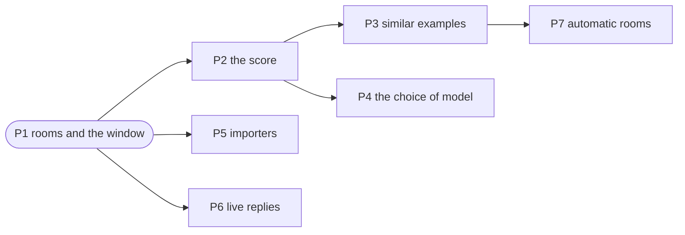

  <a href="../README.md"><b>mimikr</b></a>

# The roadmap

[docs/milestones.md](milestones.md) says what mimikr does and why.
This file says in what order to build it.

Each phase has a goal, the work in it, and an exit test.
The sizes are relative: S is a day or two, M is a week, and L is longer.

The code of each phase is built, and each exit test passes with a fake model.
P4 is open: it needs the real models and a real transcript. The exit tests of
P3 and of the continuation mode also wait for P4, because only a real model
can say if they make the replies better.

---

## The order, and the reason for it

**Measure first.**
A change to the prompt can make the replies better or worse, and a person who
reads ten replies cannot tell which.
So the score comes before the work that the score judges.

---

## P1: rooms and the window (done)

**Goal:** talk to one or more identities in a native window.

- Read `personality.md`, `chat.md` and `identity.toml`.
- Measure the style profile.
- Build the prompt, and split the reply into messages.
- Keep rooms on disk. Let the members reply in turn.
- Show the rooms in a PySide6 window.

**Exit test:** a room with two identities replies to the user, and `Next
speaker` lets the identities talk in turn. Tests with a fake model prove both.

## P2: the score (built)

**Goal:** a number that says how near the replies are to the person.

- Add `mimikr eval <identity>`.
- Keep the last part of `chat.md` apart. Give the model the conversation up to
  each real reply, and compare its reply with the real one.
- Compare the style: length, capitals, periods, emoji, messages in a row.
- Compare the meaning with a local embedding model.

**Exit test:** the score of the real replies against themselves is the best
score. The score of the replies of a different person is worse.

`tests/test_run_evaluation.py` holds the exit test. The real replies score 1
for style and 1 for meaning. One long, formal reply scores below 0.6 for style,
and below the baseline for meaning. Two more tests prove that the model never sees
the reply that it must write.

## P3: similar examples (built)

**Goal:** the examples in the prompt match the current message.

- Cut the transcript into short exchanges.
- Make an embedding of each exchange with a local model, and keep it on disk.
- For each new message, put the most similar exchanges into the prompt.

**Exit test:** the P2 score is better than with the most recent examples.

The code is built: `examples = "similar"` in rooms, and `--examples similar` in
`mimikr eval`. The tests prove that the index holds the training part only,
and that the prompt holds the exchange that matches the question. The exit
test itself runs in P4.

## P4: the choice of mode and of examples (done)

**Goal:** a default mode and choice of examples, with Mistral Nemo 12B Instruct.

The project downloads no other model. [The milestones](milestones.md) say why.
So P4 compares the ways to use one model, and not models.

- Get a real transcript of 50 turns or more.
- Run `mimikr eval` four times: the chat mode and the continuation mode, each
  with `--examples recent` and `--examples similar`.
- The continuation mode sends a chat log to an instruct model here, not to a
  base model. The score tells if that still beats the chat mode.
- Run each score two times, because the model writes different replies each
  time.
- Record the table of `mimikr scores` and the choice in
  [the milestones](milestones.md).

`mimikr scores` is built. It puts each saved report in one table.

**Exit test:** the milestones hold the table of scores, and the defaults match
the winner.

Done on 26 September 2026. The continue mode with recent examples scored 0.92
for style, and the chat mode 0.71. [The milestones](milestones.md) hold the
table, and the defaults now match it.

## P5: importers (built)

**Goal:** read the export of a chat application.

- WhatsApp, Telegram Desktop, and DiscordChatExporter.
- Each importer writes `Name: message` lines.
- iMessage is not in scope. [The milestones](milestones.md) say why.

**Exit test:** each importer reads an invented export and writes the expected
lines. `tests/test_importers.py` does this, and reads each result back through
the transcript reader.

## P6: live replies (built)

**Goal:** the reply shows while the model writes it.

**Exit test:** the first words show before the model ends its reply.

`tests/test_gui.py` streams "say" and then " less". The window shows "say"
before the reply ends, and then one message "say less" with no grey bubble.

## P7: automatic rooms (built)

**Goal:** the identities talk for a number of turns with no click.

**Exit test:** a room runs ten turns and stops. The user can stop it early.

`tests/test_gui.py` runs ten turns, stops after the third, and stops in the
middle of a reply. The stopped reply leaves no message.

---

## After P7 (built)

These came after the plan of P1 to P7. Each is built and has tests.

- A budget for the room in the prompt, so that a long room fits the context.
- Keep the clear habits of the person in each reply.
- The next speaker by name, or at random.
- The menu of a message: copy, edit, delete, write again, like.
- Realistic timing.
- Search in rooms and messages.
- An identity editor, with chat import by file or by drop.
- Start llama.cpp from the settings page.
- A macOS application, a release workflow, and a Homebrew cask.
- CI on macOS, Linux and Windows.
- Release 1.0.0: the application, its build provenance, and the cask in
  stiven-gjekaj/tap.

Still open:

---

## After 1.0 (built)

- Less repetition: avoid repeats, emoji at the habit of the person, the
  penalties, and a measure of repeats in `mimikr eval`.
- The topic of a room, and the lore of the group.
- Replies to a message.
- Builds for Windows and Linux in the release, each with a smoke test.

Still open:

- A score of the penalties, to choose their default.
- The first run of the release on Windows and Linux.
